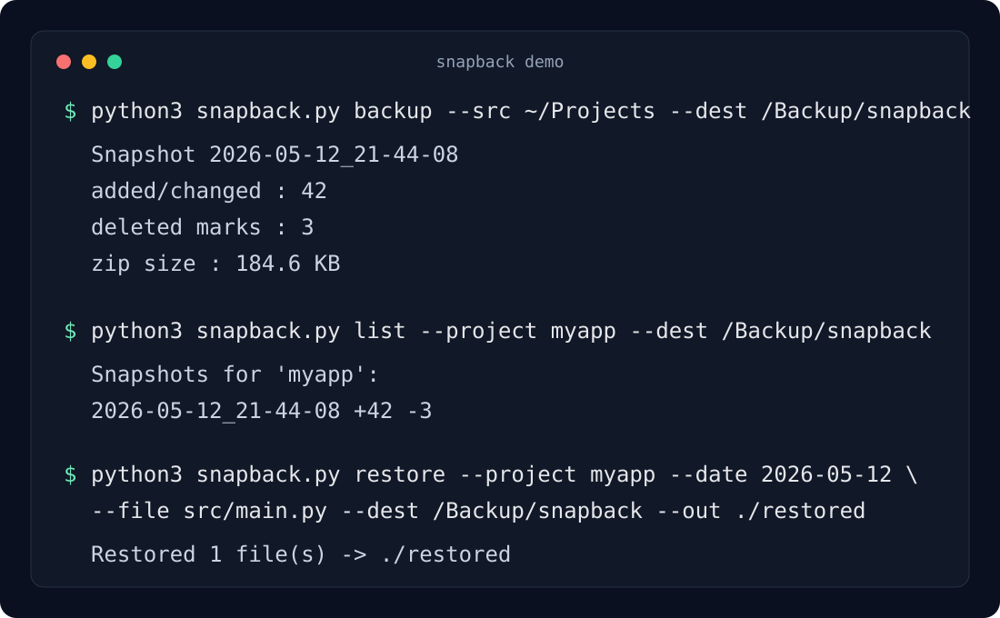

# Snapback


Small, dependable backups for project folders.

Git cannot rescue a file that never reached a commit. Cloud sync may faithfully replicate the deletion you meant to
undo. And another full copy of a sprawling projects directory? It works, right up to the moment the disk fills with
nearly identical trees.

Snapback takes the narrower route. One Python file. One SQLite database. A trail of dated ZIP archives.



## What Snapback Does

Point Snapback at a directory whose immediate children are projects. It scans their files, calculates SHA-256 hashes,
and records only the state changes since the previous snapshot. New content goes into a compressed archive; unchanged
content stays where it is.

In practical terms, Snapback:

- treats every non-hidden top-level directory inside `--src` as a separate project;
- creates an incremental snapshot only when a file was added, changed, or deleted;
- deduplicates incremental file content by SHA-256 within the active restore chain;
- creates an independent full snapshot when `--full` is requested;
- restores a whole project or one file as it existed on a chosen date;
- keeps metadata in SQLite and file bytes in ordinary ZIP archives;
- skips common build output, virtual environments, caches, IDE metadata, and compiled artifacts;
- runs on Python 3.12 using only the standard library.

No daemon lurks in the background. There is no account, remote service, proprietary archive format, or dependency
stack waiting to age badly.

## Quick Start

Clone the repository or download `snapback.py`, then check the CLI:

```bash
python3.12 snapback.py --help
```

Create a destination on a disk you trust:

```bash
mkdir -p /Volumes/Backup/snapback
```

Back up every project inside `~/Projects`:

```bash
python3.12 snapback.py backup \
  --src ~/Projects \
  --dest /Volumes/Backup/snapback
```

Nothing changed? Nothing is written. Snapback simply reports that the previous state is still current.

## Commands

### Create an incremental snapshot

```bash
python3.12 snapback.py backup \
  --src ~/Projects \
  --dest /Volumes/Backup/snapback
```

Snapback hashes the current files, compares them with the latest known state, writes genuinely new content, and stores
deletion markers for paths that disappeared. The database update is committed only after the archive has been written.

### Create a full snapshot

```bash
python3.12 snapback.py backup \
  --src ~/Projects \
  --dest /Volumes/Backup/snapback \
  --full
```

A full snapshot is deliberately less stingy with space: `full.zip` receives every current, non-ignored file. That is
the bargain. In return, the archive can be unpacked without any older ZIP files, and it becomes the base of a fresh
incremental restore chain.

Unlike an incremental run, a full run always creates a snapshot—even when no source file changed.

### List projects

```bash
python3.12 snapback.py list \
  --dest /Volumes/Backup/snapback
```

### List snapshots for one project

```bash
python3.12 snapback.py list \
  --project myapp \
  --dest /Volumes/Backup/snapback
```

### Inspect a project at a date

```bash
python3.12 snapback.py show \
  --project myapp \
  --date 2026-05-12 \
  --dest /Volumes/Backup/snapback
```

The date may be a prefix such as `2026-05-12` or a complete snapshot timestamp. Snapback selects the newest matching
snapshot on or before that value.

### Restore a project

```bash
python3.12 snapback.py restore \
  --project myapp \
  --date 2026-05-12 \
  --dest /Volumes/Backup/snapback \
  --out ./restored/myapp
```

### Restore one file

```bash
python3.12 snapback.py restore \
  --project myapp \
  --date 2026-05-12 \
  --file src/main.py \
  --dest /Volumes/Backup/snapback \
  --out ./restored/myapp
```

Restore writes the selected files into `--out`. It does not wipe that directory first, so unrelated files already
living there are left alone.

## Full Snapshot Chains

Regular restoration uses the global blob index and may read any archive that first stored the required content. This
maximizes deduplication. It also means that casually deleting an old ZIP can punch a hole in a later restore.

Full chains provide a tighter boundary:

```bash
python3.12 snapback.py restore \
  --project myapp \
  --date 2026-05-12 \
  --dest /Volumes/Backup/snapback \
  --out ./restored/myapp \
  --use-full
```

With `--use-full`, Snapback starts at the nearest full snapshot and reads only that archive plus its subsequent
incrementals. Archives from earlier chains are irrelevant to this restore. If the selected snapshot predates every
full backup, the command stops instead of silently falling back to the global history.

Snapback has no pruning command. If old archives are removed by hand, verify a newer full chain first and use
`--use-full` for snapshots anchored to it.

## Ignore Rules

Built-in rules cover the usual debris: `.git`, `.idea`, `.venv`, `node_modules`, build directories, caches, and common
compiled extensions. Extra rules can live in either of these locations:

1. `snapback.ignore` next to `snapback.py`;
2. `snapback.ignore` in the `--dest` root.

Both files are additive. Destination rules extend script-level rules; they do not cancel them.

The format is intentionally small:

```text
# Exact file or directory name, matched at any depth
.cache
coverage

# File suffix
*.log
*.tmp
```

This is not full `.gitignore` syntax. Apart from the `*.suffix` form, glob expressions are not expanded.

## Storage Layout

Everything lives below the destination:

```text
/Volumes/Backup/snapback/
├── snapback.db
└── snapshots/
    ├── 2026-05-12_21-44-08/
    │   └── data.zip
    ├── 2026-05-18_21-44-08/
    │   └── full.zip
    └── 2026-05-18_21-44-08_1/
        └── data.zip
```

Timestamp collisions receive a numeric suffix. SQLite tracks snapshots, file-state events, deletion markers, global
blob locations, and the blob copies belonging to each full chain. The ZIP files contain the bytes themselves.

Keep the destination at a stable filesystem path. Archive locations are stored as absolute paths in `snapback.db`, so
moving the backup tree or mounting its volume elsewhere breaks those references.

## Safety Boundaries

Snapback refuses to put the destination inside the source tree. It skips symbolic-link files, re-hashes each file while
writing it, and aborts the snapshot if the bytes changed between scanning and archiving. Failed writes roll back the
database transaction and remove the unfinished snapshot directory.

Still, this is a compact file-content backup tool—not a forensic image and not a vault. It does not preserve empty
directories, permissions, ownership, extended attributes, modification times, or symbolic links. It does not encrypt,
upload, replicate, verify old archives on a schedule, or manage retention. Use filesystem permissions and encrypted
storage when the backup contains sensitive material; keep another copy when the disk itself matters.

## Automation

Run incremental backups daily and full backups weekly or monthly. `launchd`, cron, and systemd timers are all enough;
Snapback needs no resident process.

The repository includes small shell wrappers for two local macOS volumes. They are examples, not portable defaults:
edit their source and destination paths before using them on another machine.

## Development

Runtime dependencies remain at zero. The test suite uses `pytest`:

```bash
python3.12 -m pytest -q
```

## License

MIT License. See [LICENSE](LICENSE).
